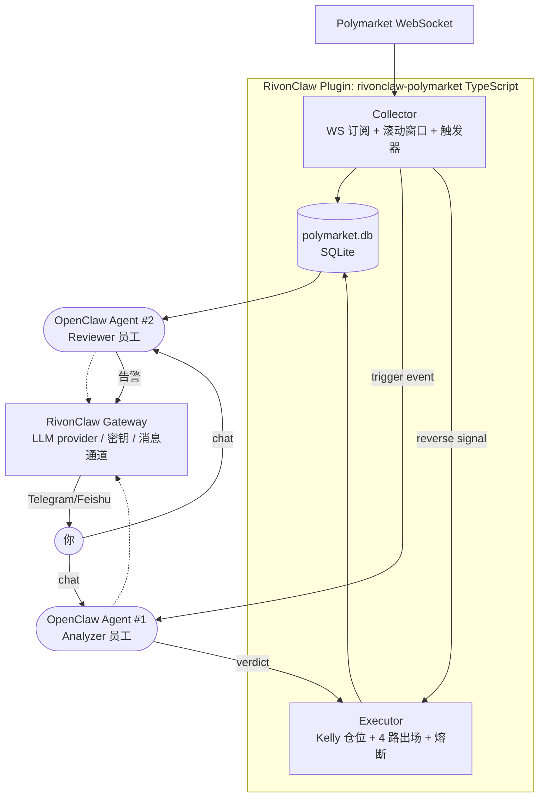

# Polymarket 交易系统 — 设计文档 (v3 精简版)

**日期**：2026-04-06
**状态**：v3 精简版（集成 RivonClaw，YAGNI 严格删减），待审阅
**核心目标**：**稳定持续盈利**（capital preservation 优先）
**集成方式**：作为 RivonClaw 的一个插件 + 两个 OpenClaw agent
**代码位置**：
- 插件：`D:/work/dlxiaclaw/extensions/rivonclaw-polymarket/`
- Agent workspace：`~/.openclaw/agents/polymarket-analyzer/` 和 `~/.openclaw/agents/polymarket-reviewer/`
**参考项目**：[west-garden/polymarket-agent](https://github.com/west-garden/polymarket-agent)（旧系统，只借鉴思路不复制代码）

---

## 1. 目标与非目标

### 1.1 核心目标

**稳定持续盈利**。可量化指标：

- 月度回撤 ≤ 5%
- 单日亏损 ≤ 2% 即触发熔断
- 月度 Sharpe ≥ 1.0
- 宁可月收益 2-4% 稳定，不要爆发周大赚后回吐

### 1.2 非目标（YAGNI 严格剔除）

首版**明确不做**的东西（等数据证明需要再加）：

- ❌ **Live Executor**：v1 只做 Paper Trading，不预留真盘接口
- ❌ **多策略**：v1 只有一个策略 `smart_money_flow`
- ❌ **Regime Gate**：先跑起来，观察真实表现再决定要不要加
- ❌ **Sweeping Mode / 反向策略**：未来 Phase 2 候选
- ❌ **Dashboard / Web UI**：用 OpenClaw 现有 chat UI 和 CLI 查状态
- ❌ **Bandit 优化器 / 策略权重动态调整**
- ❌ **策略互相冲突检测**（只有一个策略，不会冲突）
- ❌ **相关性检查 / 事件簇限制**
- ❌ **Python + IPC bridge**（全 TypeScript）
- ❌ **RivonClaw UI 改动**（不加新面板页面、不做多 agent 管理 UI）
- ❌ **外部新闻 / Twitter 集成**
- ❌ **回测工具 / 历史数据回灌**（旧系统没在跑，无历史数据可用）

---

## 2. 旧系统诊断摘要（避免重蹈覆辙）

对 `west-garden/polymarket-agent` 代码做过完整审阅（详见 git commit `0b56382`、`c4492e4` 的完整诊断）。**新系统必须避免**的 6 个致命问题：

1. **5 个策略互相抵消 + UCB churning 主动挪仓** → 新系统只 1 个策略，冲突处理用 first-come-first-served，禁止任何主动挪仓
2. **共识验证被 4 个豁免架空**（尾盘 / copytrading / flow / self-reported confidence ≥0.70）→ 新系统硬规则就是硬规则，不接受 self-reported confidence
3. **$30/market 仓位吃不掉成本**（fee + 滑点 + gas 吃光微利）→ 新系统 Kelly 动态仓位 + 最低 $50 确保成本占比 < 3%
4. **14 个硬编码阈值、`[0.60, 0.85]` dead zone 无数据支撑** → 新系统静态 dead zone 保留（旧系统实证 34% 胜率），但 Reviewer 用真实数据动态覆盖
5. **反馈回路是 dead code**（`update_dynamic_dead_zones` 和 `get_calibration_report` 定义了但从没被调用）→ 新系统 Reviewer agent 由 OpenClaw cron 强制每日调用
6. **gas fee / 滑点没进 PnL** → 新系统 signal_log 强制记录 gross/fees/slippage/gas/net 五列

---

## 3. 架构：1 插件 + 2 OpenClaw Agent

### 3.1 整体图



### 3.2 模块划分与职责

#### 插件 `rivonclaw-polymarket`（TypeScript，在 gateway 进程里跑）

两个**纯代码模块**，不调 LLM，常驻运行：

**Collector 子模块**
- 订阅 Polymarket WebSocket activity stream，断线指数退避重连
- 机器人过滤（同地址 1 秒 > 10 笔即忽略）
- 按 market 维护滚动窗口统计：1m/10m 成交量、独立 trader 数、净流入、赔率移动
- 触发器命中时通过 RPC 调用 Analyzer agent

**Executor 子模块**
- 订阅 Analyzer 的 verdict 响应
- 按桶 Kelly 仓位计算
- 组合级熔断检查（日内 / 月度 DD）
- PaperExecutor（唯一实现）：用当前 mid price + 可配滑点成交
- 持仓管理器 + 四路出场监控（E/A/D/C）
- **冲突处理：first-come-first-served + reject 后到信号（用 asyncio.Lock 式的 TS mutex）**
- **禁止主动平仓换仓**

#### OpenClaw Agent #1：**Analyzer 员工**

- OpenClaw agent 实例，workspace 在 `~/.openclaw/agents/polymarket-analyzer/`
- 有自己的 `AGENTS.md`（定义角色 / 判断准则）
- 被 Collector 触发调用：接收 market 上下文，LLM 判断真伪，返回结构化 verdict
- 你可以在 RivonClaw chat UI 里直接和他聊："今天的 BTC market 你为什么不进？"
- 用 RivonClaw 已配好的 LLM provider（默认 Claude Opus 4.6）

#### OpenClaw Agent #2：**Reviewer 员工**

- OpenClaw agent 实例，workspace 在 `~/.openclaw/agents/polymarket-reviewer/`
- 由 **OpenClaw cron** 每天 00:00 UTC 触发（这是旧系统 H5 的根本修复：必须主动调用）
- 读 `polymarket.db` 的 `signal_log` 和 `strategy_performance`
- 产出两样东西：
  1. 复盘报告（markdown，写进 workspace）
  2. 过滤器调整建议（写进 `filter_proposals` 表，等人审）
- 自动熔断判定（胜率连续 10 笔 < 45% 写 `strategy_kill_switch`）
- 有重大事件时通过 RivonClaw channel sender 推送 Telegram/Feishu 告警
- 你可以在 chat UI 里问："上周表现如何"、"哪个价格桶最赚钱"

### 3.3 模块间通信

- **Collector → Analyzer**：通过 RivonClaw 的 `GatewayRpcClient.request("agent.run", ...)` 调用
- **Analyzer → Executor**：Analyzer 的返回结果由 Collector 接收后转给 Executor（同一进程内函数调用）
- **Executor → Collector**：订阅同一事件总线获取反向信号（D 出场）
- **Reviewer 读 DB**：Reviewer agent 有 `sqlite_read` 工具读 `polymarket.db`

---

## 4. 策略：Smart Money Flow（唯一策略）

### 4.1 Edge 假设

> **"在 Polymarket 非死亡价区，当出现 `净流入 + 多人真钱共识 + 赔率移动` 三路同时发生时，存在真实的短期定价偏差，LLM 能判断方向。"**

### 4.2 触发条件（Collector 计算）

全部必须满足：

| 条件 | 初始阈值 |
|------|---------|
| 单笔金额过滤 | ≥ $200 |
| 净流入（买 - 卖，1 分钟窗口） | ≥ $3000 |
| 独立 trader 数（1 分钟窗口） | ≥ 3 人 |
| 赔率移动（5 分钟窗口） | ≥ 3% 且方向一致 |
| 流动性（order book 深度） | ≥ $5000 |
| 剩余时间 | 30 分钟 ≤ t ≤ 72 小时 |
| 价格允许值域 | 0.01 ≤ price ≤ 0.99 |
| **静态死亡区间** | **price ∉ [0.60, 0.85]** |
| 非 "up or down" 黑名单 market | 过滤 |

**机器人过滤**：同地址 1 秒 > 10 笔 → 整个地址当 session 忽略

**大单豁免**（跳过 trader 数要求，但不豁免其他）：
- 单笔 ≥ $5000，或
- 净流入 ≥ $10000

### 4.3 价格范围与死亡区间

- **允许值域**：`0.01 – 0.99`（Polymarket 天然值域）
- **v1 静态死亡区间**：`[0.60, 0.85]`（旧系统实证约 34% 胜率）
- **动态覆盖**：Reviewer 拿到 2-4 周数据后，按 0.05 价格桶重新计算胜率 < 35% 的区间并写回 `filter_config`，人审后生效
- **Kelly 自动抑制**：即使不在死亡区间，如果某价格桶的历史胜率对应 Kelly 分数 ≤ 0，系统自动不交易

---

## 5. 出场规则

触发优先级从高到低：**E > A-SL > D > A-TP > C**

| 代号 | 机制 | 触发条件 | 默认参数 |
|------|------|---------|---------|
| **E** | 执行安全缓冲 | 距 resolution < buffer（确保平仓单能落地） | 5 分钟（`TBD_FROM_POLYMARKET_DOCS`：实际需查 CLOB lock 时间） |
| **A-SL** | 硬止损 | 当前价穿越止损线 | 常规 7%；剩余 < 30 分钟收紧到 3% |
| **D** | 反向信号 | Collector 触发了反方向的策略信号 | 立即平仓（预期最常触发） |
| **A-TP** | 硬止盈 | 当前价达止盈线 | 10% |
| **C** | 时间止损 | 持仓时长 > 上限 | 4 小时 |

---

## 6. 仓位与资金管理

### 6.1 按价格桶的 Kelly 仓位

```
price_bucket = floor(entry_price / 0.05) * 0.05
win_rate     = strategy_performance[桶].win_rate || 先验
payoff_ratio = (1 - entry_price) / entry_price
fraction     = (win_rate × payoff_ratio - (1 - win_rate)) / payoff_ratio
size         = capital × fraction × kelly_multiplier
```

**先验（Bootstrap 阶段）**：

| 价格桶 | 先验胜率 |
|--------|---------|
| 0.01 – 0.60 | 0.50（中性） |
| **0.60 – 0.85** | **0.34**（旧系统实证死亡区间，Kelly 自动给 0） |
| 0.85 – 0.99 | 0.50（中性，但极端价位 Kelly 仍给极小仓位） |

**硬约束**：

- `kelly_multiplier = 0.25`（四分之一 Kelly）
- **单笔最大损失 ≤ $50**
- **单笔最大仓位 ≤ $300**
- **单笔最小仓位 = $50**（低于此不交易，避免 fee/滑点占比过高）

### 6.2 组合级限制

- 总持仓上限：$2000
- 同时持仓数量：≤ 8
- **gas fee 必须进 PnL**（每笔预留 $0.20）

### 6.3 熔断

| 类型 | 触发 | 动作 |
|------|------|------|
| 日内回撤 | 当日 PnL ≤ -2% | 停止新开仓，次日 UTC 0 点重置 |
| 周回撤 | 周内 PnL ≤ -4% | 停止新开仓，人审后恢复 |
| 策略熔断 | 连续 10 笔胜率 < 45% | 写 `strategy_kill_switch`，Reviewer 下次运行时人审 |
| 总回撤 | 历史峰值回撤 > 10% | 紧急停机，持仓 30 分钟内平完 |

---

## 7. 数据模型（最小集）

所有表在 `~/.rivonclaw/polymarket.db`（独立 SQLite 文件，不污染 RivonClaw 主库）。

### 7.1 `signal_log`

| 字段 | 类型 | 说明 |
|------|------|------|
| `signal_id` | TEXT PK | UUID |
| `market_id` | TEXT | |
| `market_title` | TEXT | |
| `resolves_at` | INTEGER | Unix ms |
| `triggered_at` | INTEGER | |
| `direction` | TEXT | `buy_yes` / `buy_no` |
| `entry_price` | REAL | |
| `price_bucket` | REAL | floor(price/0.05)*0.05 |
| `size_usdc` | REAL | |
| `kelly_fraction` | REAL | |
| `snapshot_volume_1m` | REAL | |
| `snapshot_net_flow_1m` | REAL | |
| `snapshot_unique_traders_1m` | INTEGER | |
| `snapshot_price_move_5m` | REAL | |
| `snapshot_liquidity` | REAL | |
| `llm_verdict` | TEXT | |
| `llm_confidence` | REAL | 仅作记录和 Reviewer 复盘，**不作为下单门槛** |
| `llm_reasoning` | TEXT | |
| `exit_at` | INTEGER NULL | |
| `exit_price` | REAL NULL | |
| `exit_reason` | TEXT NULL | `E/A_SL/A_TP/D/C` |
| `pnl_gross_usdc` | REAL NULL | |
| `fees_usdc` | REAL NULL | |
| `slippage_usdc` | REAL NULL | |
| `gas_usdc` | REAL NULL | |
| `pnl_net_usdc` | REAL NULL | **gross - fees - slippage - gas**，决策用 |
| `holding_duration_sec` | INTEGER NULL | |

### 7.2 `strategy_performance`

按价格桶滚动统计（Reviewer 每日重算）。

| 字段 | 类型 |
|------|------|
| `price_bucket` | REAL PK |
| `window` | TEXT PK (`7d` / `30d`) |
| `trade_count` | INTEGER |
| `win_count` | INTEGER |
| `win_rate` | REAL |
| `total_pnl_net` | REAL |
| `last_updated` | INTEGER |

### 7.3 `filter_config`

KV 表，Analyzer/Executor 启动时加载，Reviewer 可写入建议。

### 7.4 `filter_proposals`

Reviewer 产出的待审建议（字段：`field`, `old_value`, `proposed_value`, `rationale`, `status`）。

### 7.5 `strategy_kill_switch`

（即便只有一个策略，结构仍保留便于日后扩展；v1 只会有一条 `smart_money_flow` 记录）

### 7.6 `portfolio_state`

KV 表：`total_capital`, `current_equity`, `day_start_equity`, `week_start_equity`, `peak_equity`, `current_drawdown`, `daily_halt_triggered`。

### 7.7 `llm_audit_log`

每次 Analyzer/Reviewer LLM 调用的完整记录（通过 OpenClaw 自己的 session store 就有，**不单独建表**）。

---

## 8. 技术栈

| 组件 | 选择 |
|------|------|
| 语言 | **TypeScript**（与 RivonClaw 一致） |
| 运行时 | Node.js 24+（在 RivonClaw gateway 进程里） |
| 插件 SDK | `@rivonclaw/plugin-sdk` 的 `defineRivonClawPlugin()` |
| 密钥存储 | `@rivonclaw/secrets`（Polymarket 钱包 key 存 Keychain/DPAPI） |
| LLM 调用 | RivonClaw gateway 的 LLM provider 配置（Agent 自动使用） |
| 消息推送 | RivonClaw 的 channel senders（Telegram / Feishu / Discord） |
| 数据库 | `better-sqlite3`（`polymarket.db` 独立文件） |
| WS 客户端 | `ws` |
| Polymarket SDK | `@polymarket/clob-client`（官方 TS 客户端，未来真盘用） |
| 测试 | `vitest`（与 RivonClaw 一致） |
| 构建 | `tsdown`（与 RivonClaw 插件一致） |

---

## 9. 错误处理与可靠性

- **禁止吞异常**：所有 `catch` 必须具体异常类型，不能 bare catch 静默
- **WS 断线**：指数退避重连；断线期间持仓仍由 Executor 按 A/C/E 保护（Executor 独立于 Collector）
- **LLM 超时**：Analyzer agent 单次调用超时 30 秒即放弃该信号
- **数据库写失败**：critical，进入 safe mode 停新单
- **gateway 崩溃**：插件跟随重启；启动时扫 `signal_log.exit_at IS NULL` 恢复内存持仓状态
- **gas fee 必须进 PnL**：不能当免费成本（旧系统 bug）

---

## 10. 测试策略（最小必需集）

- **Collector**：滚动窗口计算 + 触发器组合（录制 WS 数据 fixture 回放）
- **Executor**：Kelly 计算 + 四路出场 + 熔断 → **100% 分支覆盖**
- **Analyzer agent**：LLM 调用 mock + prompt 回归测试
- **Reviewer agent**：合成 signal_log 数据验证统计分桶
- **端到端**：录制 1 小时 WS 数据 → paper trading → 断言 signal_log + PnL

---

## 11. 交付里程碑

**M1（Week 1-2）：数据底座**
- 新建插件 `extensions/rivonclaw-polymarket/`
- polymarket.db schema + migrations
- Collector：WS 订阅 + 滚动窗口 + 触发器（只写日志不下单）
- 插件能被 RivonClaw 加载、能持续跑 24 小时不崩

**M2（Week 3-4）：Analyzer agent + PaperExecutor**
- 创建 OpenClaw agent workspace `polymarket-analyzer` + AGENTS.md
- Collector → Analyzer RPC 调用 + 结构化 verdict 解析
- Kelly 仓位 + 按价格桶先验 + $50 单笔最大损失
- PaperExecutor + 四路出场 + 组合级熔断
- 完整 paper trading 跑 1 周

**M3（Week 5）：Reviewer agent + 反馈回路**
- 创建 OpenClaw agent workspace `polymarket-reviewer` + AGENTS.md
- OpenClaw cron 每日触发
- strategy_performance 统计 + filter_proposals 产出
- 通过 RivonClaw channel senders 推送告警
- CLI 命令：审阅 proposals、触发 Reviewer 手动运行

**M4（Week 6）：稳定观察期**
- 持续 paper trading 2-4 周
- 收集 baseline 数据
- 用 Reviewer 真实反馈验证 Kelly 动态仓位、死亡区间更新的效果
- 如数据良好，才进入 Phase 2 规划（Live / Regime Gate / 其他策略）

**明确不做**：M4 之后的内容**暂时不写进 spec**，YAGNI。等 M4 数据出来再决定下一步。

---

## 12. 已确认的设计决定

- **目标**：稳定持续盈利（月 DD ≤ 5%、Sharpe ≥ 1.0）
- **语言**：TypeScript（为了无缝集成 RivonClaw）
- **形态**：1 个 RivonClaw 插件 + 2 个 OpenClaw agent（Analyzer / Reviewer）
- **复用**：RivonClaw 的 LLM gateway、secret store、channel senders、plugin SDK
- **不做**：§1.2 列出的所有 YAGNI 项
- **旧系统处理**：零复制代码，只借鉴算法思路，所有模块从零重写
- **价格范围**：0.01-0.99 允许值域，`[0.60, 0.85]` 为 v1 静态死亡区间
- **单笔仓位**：按价格桶 1/4 Kelly + 单笔最大损失 $50 + 仓位 [$50, $300]
- **策略数量**：v1 只 1 个 `smart_money_flow`
- **执行模式**：v1 只 Paper Trading，不做 Live

---

## 13. 开放问题（实现前对齐）

1. **监控 market 范围**：当前 24h 成交额前 50，还是全量？
2. **Paper 起始资金**：$10,000 USDC？
3. **Polymarket CLOB 实际 lock 时间**：E 的真实值（实现第一步要查官方文档）
4. **告警优先级**：熔断触发走 Telegram 还是 Feishu？（用你已配的哪个）
5. **Analyzer agent 的 system prompt**：v1 用什么初始 prompt？（M2 前需要写一版）

---

## 14. 参考

- [west-garden/polymarket-agent](https://github.com/west-garden/polymarket-agent) — 旧系统诊断对象
- [Polymarket/agents](https://github.com/Polymarket/agents) — 官方 agents 框架（py_clob_client 参考）
- RivonClaw 代码库本身（`packages/plugin-sdk`, `packages/gateway`, `packages/secrets`, `apps/desktop/src/channels`）
- Kelly criterion（分数 Kelly 的风控应用）
