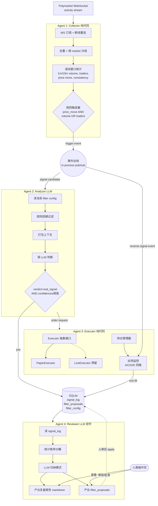

# Polymarket 多 Agent 交易系统 — 设计文档

**日期**：2026-04-06
**状态**：草案，待审阅
**作者**：brainstorming session
**相关参考**：[Polymarket/agent-skills](https://github.com/Polymarket/agent-skills)

---

## 1. 目标与背景

构建一个**独立运行**的 Polymarket 预测市场自动交易系统，由 4 个协作 agent 组成。系统通过订阅 Polymarket 的公开 activity WebSocket 数据流（每秒数百笔成交），识别"异常活跃度爆发 + 赔率偏离"的事件驱动机会，在 LLM 判断真伪后自动建仓，并在仓位生命周期内自动止盈止损。所有交易决策回流到一份中枢**信号日志**，由复盘 agent 定期分析并产出"过滤器参数调整建议"，形成闭环迭代。

### 核心设计哲学

> **"快反应用代码、慢思考用 LLM"**
>
> 数据接入、滚动统计、止盈止损触发 → 确定性代码（毫秒级、稳定、可测试）
> 信号真伪判断、复盘归因 → LLM（少量调用、高价值、延迟可接受）

### 非目标（明确不做的事）

- **不接外部新闻/Twitter API**：所有输入均来自 Polymarket 自身的市场行为数据（成交流、赔率、trader 地址）
- **不做高频套利**：信号时间尺度是分钟到小时，不是毫秒
- **不做聪明钱地址库 (C)**：首版省略，等数据积累足够后再加
- **不全自动迭代参数**：Reviewer 的建议必须经人审后才生效
- **不直接上真盘**：首版只做 Paper Trading，真盘执行器仅留接口

---

## 2. 策略假设（edge 来源）

系统的盈利假设是：

> **"市场行为本身就是最快的新闻。"**
>
> 当某个 market 出现**成交量突增 + 独立地址数突增 + 赔率单边移动**三路同时发生时，大概率是有人先知道了某个事件；在 LLM 判断该 market 的当前赔率确实偏离"新的真实概率"时介入，在事件能量耗尽或信号反转时退出。

### 2.1 入场触发器（Trigger）

由 Collector 在滚动时间窗口内持续计算三个指标：

| 指标 | 含义 | 默认阈值（可动态调） |
|------|------|---------------------|
| `volume_spike` | 最近 1 分钟成交额 / 最近 1 小时均值 | ≥ 5× |
| `unique_traders_spike` | 最近 1 分钟独立新地址数 / 过去均值 | ≥ 3× |
| `price_move_with_volume` | 最近 5 分钟 mid price 变动 + 对应成交量确认 | ≥ 3% 且伴随放量 |

**触发条件**：`price_move_with_volume` **必须命中**（代表有真金在推），且 `volume_spike` 和 `unique_traders_spike` **至少命中一个**（过滤纯机器人刷量）。

### 2.2 LLM 判断（Analyzer）

触发器命中后，Analyzer 把以下上下文打包给 LLM：

- market 标题和描述
- 当前赔率与最近 10 分钟赔率路径
- 最近 N 笔成交的方向、规模、trader 地址
- 滚动窗口指标快照
- 趋势一致性评分（赔率、成交量、地址数三路是否同向）

LLM 产出结构化 JSON：

```json
{
  "verdict": "real_signal" | "noise" | "uncertain",
  "direction": "buy" | "sell",
  "confidence": 0.0-1.0,
  "reasoning": "自然语言解释"
}
```

只有 `verdict=real_signal` 且 `confidence ≥` 配置阈值时才下单。

### 2.3 出场规则（Executor 监控，优先级从高到低）

| 代号 | 机制 | 触发条件 |
|------|------|---------|
| **E** | 到期兜底 | 距 market resolution 时间 < 配置 buffer（默认 2 小时），无条件平仓 |
| **A-SL** | 硬止损 | 当前价穿越预设硬止损线（默认入场价 ±7%） |
| **D** | 反向信号 | Collector 在同一 market 上触发了**反方向**的入场条件 |
| **A-TP** | 硬止盈 | 当前价达到预设止盈线（默认入场价 ±10%） |
| **C** | 时间止损 | 持仓时长 > 配置上限（默认 4 小时） |

**D 是预期最常触发的出场原因**（"推动你进场的资金消失了就撤"），A/C/E 是安全网。

---

## 3. 模块架构

系统由 4 个 agent 组成，共享**一条内存事件总线**和**一份 SQLite 数据库**（中枢为 `signal_log` 表）。

### 3.1 高层数据流



### 3.2 各模块职责

#### Agent 1 — Collector（常驻，纯代码）

**职责**：接入数据 + 计算触发器，不调 LLM。

- 订阅 Polymarket activity WebSocket；断线自动重连；事件去重（按事件 id 或 tx hash）
- 维护内存中的滚动窗口状态：每个活跃 market 的 `volume_1m/10m`、`unique_traders_1m/10m`、`price_path`、`trend_consistency_score`
- 每收到一笔成交：更新对应 market 的窗口 → 重新评估触发器 → 命中则向事件总线发 `TriggerEvent`
- 定期 GC 长时间无成交的 market 状态，防止内存无限增长

**输出**：`TriggerEvent { market_id, timestamp, direction, snapshot_metrics }`

**不做**：下单决策、LLM 调用、持仓管理

#### Agent 2 — Analyzer（触发式，LLM 调用）

**职责**：把触发器事件翻译成"是否要交易"的决策。

- 订阅事件总线的 `TriggerEvent`
- 读取 **动态 filter config**（从 `filter_config` 表）：应用规则层硬过滤（比如"剩余时间必须 > 配置下限"、"一致性评分必须 ≥ 配置值"）
- 过关的事件：拉取 market 元信息 + 最近成交明细 + 当前快照，打包成 prompt
- 调用 LLM（Claude Opus 4.6），解析结构化 JSON verdict
- `real_signal` 且 `confidence ≥ 阈值` → 写一条 `signal_log` 记录 → 发 `OrderRequest` 到 Executor
- 所有 LLM 调用（含 noise/uncertain）均落盘审计，供 Reviewer 复盘使用

#### Agent 3 — Executor（常驻，纯代码）

**职责**：订单执行 + 仓位生命周期管理，不调 LLM。

- 定义 `Executor` 抽象：`place_order(req) -> Fill`, `close_position(pos_id, reason) -> Fill`
- **PaperExecutor**（v1 唯一实现）：
  - 使用 Collector 当前快照的 mid price 作为成交价（可配置滑点）
  - 不上链，只写数据库，回填 `signal_log.entry_*` 字段
- **LiveExecutor**（v1 仅留接口签名，不实现）
- **持仓管理器**：维护 open positions 列表；对每个持仓起一个异步监控任务，循环检查 A/C/E 条件
- **D 出场（反向信号）**：持仓管理器订阅事件总线的 `TriggerEvent`；当某个 open position 所在 market 又触发了**反方向**的 trigger 时，立即平仓
- 出场时：回填 `signal_log.exit_*`、`pnl`、`exit_reason`、`holding_duration`

#### Agent 4 — Reviewer（定时 + 手动，LLM 调用）

**职责**：读历史信号日志，产出复盘报告 + 参数调整建议。

**默认触发**：每周日 UTC 00:00 自动跑一次；也可 CLI 手动触发。

**流程**：
1. 读 `signal_log` 全表（或最近 N 天，可配置）
2. 基础统计分桶：按 `entry_price` 区间、`time_to_resolution` 区间、`volume_bucket`、`direction`、`consistency_score` 分别算胜率和平均 PnL
3. 把统计结果 + 若干典型赢家/输家样本喂给 LLM，让它归纳语言化的模式
4. 产出两件东西：
   - **复盘报告**：markdown 文件，写入 `reports/review-YYYY-MM-DD.md`
   - **filter_proposals 记录**：每条建议一行，包含 `field`, `old_value`, `proposed_value`, `rationale`, `supporting_sample_count`, `expected_delta_winrate`, `status=pending`
5. **不自动 apply**：等人审

**人审流程**：人类通过 CLI 命令审阅 pending 建议：`cli review list` / `cli review approve <id>` / `cli review reject <id>`；approve 后写入 `filter_config` 表，下次 Analyzer 触发时立即生效（热加载）。

---

## 4. 数据模型

### 4.1 `signal_log`（中枢表）

每条记录 = 一次被实际执行的信号（Paper 或 Live）。

| 字段 | 类型 | 说明 |
|------|------|------|
| `signal_id` | TEXT PK | UUID |
| `market_id` | TEXT | Polymarket market id |
| `market_title` | TEXT | 冗余存一份，方便复盘 |
| `resolves_at` | TIMESTAMP | market 结算时间 |
| `triggered_at` | TIMESTAMP | 触发器命中时间 |
| `direction` | TEXT | `buy` / `sell` |
| `entry_price` | REAL | Polymarket 赔率 (0–1) |
| `size_usdc` | REAL | 仓位名义金额 |
| `snapshot_volume_1m` | REAL | 触发时刻快照 |
| `snapshot_volume_10m` | REAL | |
| `snapshot_unique_traders_1m` | INTEGER | |
| `snapshot_price_move_5m` | REAL | |
| `snapshot_trend_consistency` | REAL | 0–1 评分 |
| `llm_verdict` | TEXT | `real_signal` / `noise` / `uncertain` |
| `llm_confidence` | REAL | 0–1 |
| `llm_reasoning` | TEXT | LLM 原文 |
| `exit_at` | TIMESTAMP NULL | 尚未平仓则为 NULL |
| `exit_price` | REAL NULL | |
| `exit_reason` | TEXT NULL | `A_SL` / `A_TP` / `C_TIME` / `D_REVERSE` / `E_EXPIRY` |
| `pnl_usdc` | REAL NULL | |
| `holding_duration_sec` | INTEGER NULL | |
| `mode` | TEXT | `paper` / `live` |

### 4.2 `filter_config`（动态过滤器配置）

KV 表，Analyzer 启动时加载，每次触发前热读（或用文件监听）。

| 字段 | 类型 |
|------|------|
| `key` | TEXT PK |
| `value` | REAL / TEXT |
| `updated_at` | TIMESTAMP |
| `source` | TEXT (`default` / `proposal:<id>`) |

关键 key 举例：`volume_spike_threshold`, `unique_traders_spike_threshold`, `price_move_min_pct`, `min_time_to_resolution_sec`, `min_trend_consistency`, `llm_confidence_threshold`, `stop_loss_pct`, `take_profit_pct`, `max_holding_sec`, `expiry_buffer_sec`, `default_position_size_usdc`。

### 4.3 `filter_proposals`（Reviewer 产出，待人审）

| 字段 | 类型 |
|------|------|
| `proposal_id` | INTEGER PK |
| `created_at` | TIMESTAMP |
| `field` | TEXT |
| `old_value` | TEXT |
| `proposed_value` | TEXT |
| `rationale` | TEXT (LLM 原文) |
| `sample_count` | INTEGER |
| `expected_delta_winrate` | REAL |
| `status` | TEXT (`pending` / `approved` / `rejected`) |
| `reviewed_at` | TIMESTAMP NULL |

### 4.4 `llm_audit_log`

每次 Analyzer 和 Reviewer 的 LLM 调用都落盘：输入 prompt、输出、用时、token 消耗。方便排查和成本监控。

---

## 5. 技术栈（默认选择，待用户确认）

| 组件 | 选择 | 理由 |
|------|------|------|
| 语言 | **Python 3.11+** | 数据分析 (pandas) + LLM SDK 生态最顺；WS 订阅 `websockets` 库足够 |
| LLM | **Claude Opus 4.6** (`claude-opus-4-6`) | 本项目 brainstorming 用的同款；未来可配置切换 |
| LLM SDK | `anthropic` 官方 Python SDK | |
| 数据库 | **SQLite** (单文件) | 零基础设施；未来迁 Postgres 很直接 |
| WS 客户端 | `websockets` 或 `aiohttp` | |
| 事件总线 | `asyncio.Queue` / 自定义轻量 pub/sub | 不引入外部 broker |
| 配置 | YAML 文件 + `filter_config` 表热加载 | |
| CLI | `typer` 或 `click` | `cli start / stop / review / report` |
| 测试 | `pytest` + `pytest-asyncio` | |

> **如果用户希望与 RivonClaw 项目保持技术栈一致**，可改为 TypeScript/Node。三个主要影响：(1) Reviewer 的统计层得靠自己写而不是 pandas；(2) LLM SDK 改 `@anthropic-ai/sdk`；(3) 其他无差别。

---

## 6. 错误处理与可靠性

- **WS 断线**：指数退避重连；断线期间丢失的数据不补回（策略时间尺度是分钟级，丢 5 秒无影响）
- **LLM 超时 / rate limit**：Analyzer 单次 LLM 调用超时 30 秒即放弃该信号（不重试），计入 `llm_audit_log` 的 `timeout` 状态
- **LLM JSON 解析失败**：直接丢弃该信号，记审计
- **数据库写失败**：critical error，整个系统进入 safe mode（停止下新单，已有持仓继续用 A/C/E 保护）
- **PaperExecutor 下单逻辑 bug**：单元测试 100% 覆盖各出场分支
- **崩溃恢复**：启动时扫 `signal_log` 里 `exit_at IS NULL` 的记录，重建持仓状态到内存

---

## 7. 测试策略

- **Collector**：用录制的 WS 数据回放作为 fixture，验证滚动窗口计算的正确性；触发器 unit test 覆盖各组合
- **Analyzer**：LLM 调用用 mock，unit test 验证规则层过滤逻辑 + JSON 解析 + 下单决策
- **Executor**：Paper 模式下模拟各种价格序列，验证 A/C/D/E 四类出场都能正确触发，且优先级正确
- **Reviewer**：用合成的 `signal_log` 数据（赢家和输家各一批）验证统计分桶正确；LLM 用 mock
- **端到端集成测试**：用一份录制的 1 小时真实 WS 数据跑全流程，断言 paper 交易数量、PnL 计算、数据库状态一致

---

## 8. 分阶段交付里程碑

**里程碑 1（最小可用）**：
- Collector + 滚动窗口 + 触发器
- PaperExecutor + A/C/E 出场（先不做 D）
- Analyzer + 一个写死的简单 prompt
- 最简 CLI：`start` / `stop` / `status`
- 能跑一整天不崩、能产出 signal_log 数据

**里程碑 2（核心闭环）**：
- D（反向信号）出场
- Reviewer + 统计分桶 + LLM 归纳 + filter_proposals
- CLI 审阅命令
- 热加载 filter_config

**里程碑 3（生产化）**：
- LiveExecutor 真实实现（需要钱包集成和签名）
- 监控 / 告警（系统健康度、每日 PnL 推送）
- 参数网格搜索工具（作为 Reviewer 的辅助）

**非目标（不做）**：聪明钱地址库、新闻 API 集成、多 market 组合仓位、Web UI。

---

## 9. 已确认与开放问题

### 已确认
- **技术栈**：Python 3.11+
- **Collector / Executor 定位**：纯代码模块，不调 LLM
- **LLM 介入点**：仅 Analyzer 和 Reviewer 两处
- **执行模式**：首版 Paper Trading only，Live 仅留接口
- **策略 edge**：事件驱动 + 市场内部数据（不接外部新闻/Twitter）
- **出场组合**：A + C + D + E 四路并行，D 为主触发
- **自我改进机制**：Reviewer 产出 filter_proposals，人审后才生效
- **代码仓库**：**新建独立 repo**，不作为 `dlxiaclaw` 的子项目；建议目录结构见下方

### 建议的新 repo 结构

```
polymarket-trader/
├── pyproject.toml
├── README.md
├── config/
│   └── default.yaml
├── src/
│   └── polymarket_trader/
│       ├── __init__.py
│       ├── collector/         # Agent 1
│       ├── analyzer/          # Agent 2
│       ├── executor/          # Agent 3
│       ├── reviewer/          # Agent 4
│       ├── event_bus.py
│       ├── db/                # SQLite schema + migrations
│       ├── llm/               # Anthropic client wrapper
│       └── cli.py
├── tests/
│   ├── fixtures/              # 录制的 WS 数据回放
│   ├── test_collector.py
│   ├── test_analyzer.py
│   ├── test_executor.py
│   ├── test_reviewer.py
│   └── test_e2e.py
└── reports/                   # Reviewer 产出的复盘报告（gitignored）
```

### 开放问题（待实现前再对齐）

1. **监控 market 范围**：默认监控 Polymarket 当前 24h 成交额前 50 的 market，还是全量？（全量对 Collector 内存压力更大）
2. **Paper 起始资金**：默认 $10,000 USDC，单笔默认 $100？
3. **Reviewer 运行频率**：每周一次（默认）还是每天一次？

---

## 10. 参考

- [Polymarket/agent-skills](https://github.com/Polymarket/agent-skills) — 启发来源，Polymarket 官方发布的 skill 参考实现
- Polymarket CLOB API & WebSocket docs（实现阶段详查）
- Anthropic Agent 分工建议："LLM for slow reasoning, code for fast reaction"
